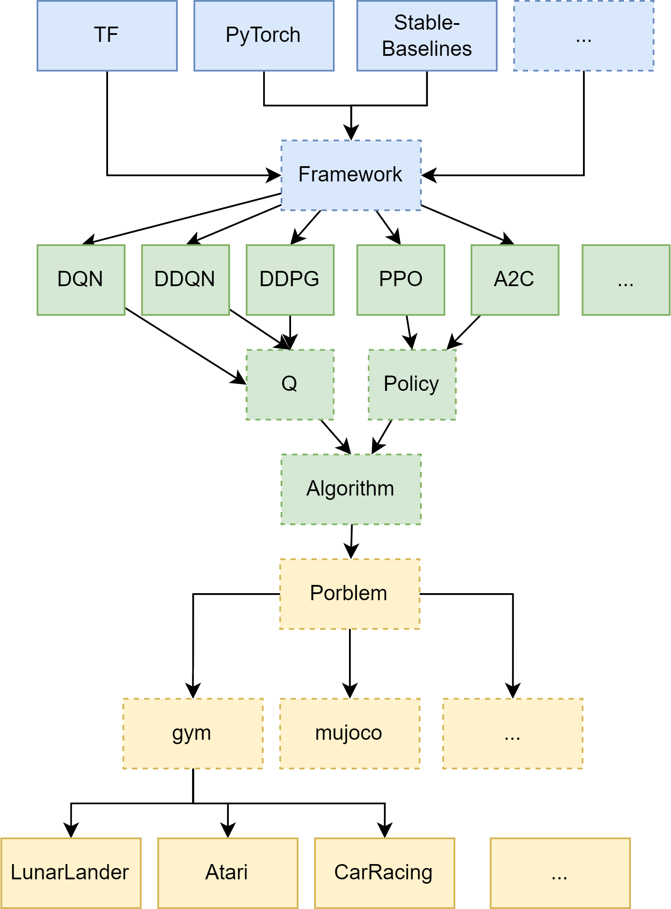

# RL_frameworks_bench
Playing with varios RL algorithms withing various ML\RL frameworks.

Implementation of classic RL algorithms like DQN\PPO with modification in TF and Torch and testing them for classic problems from gym.

